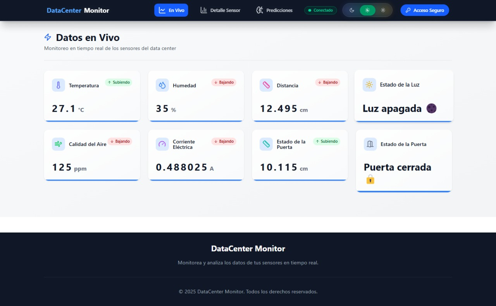
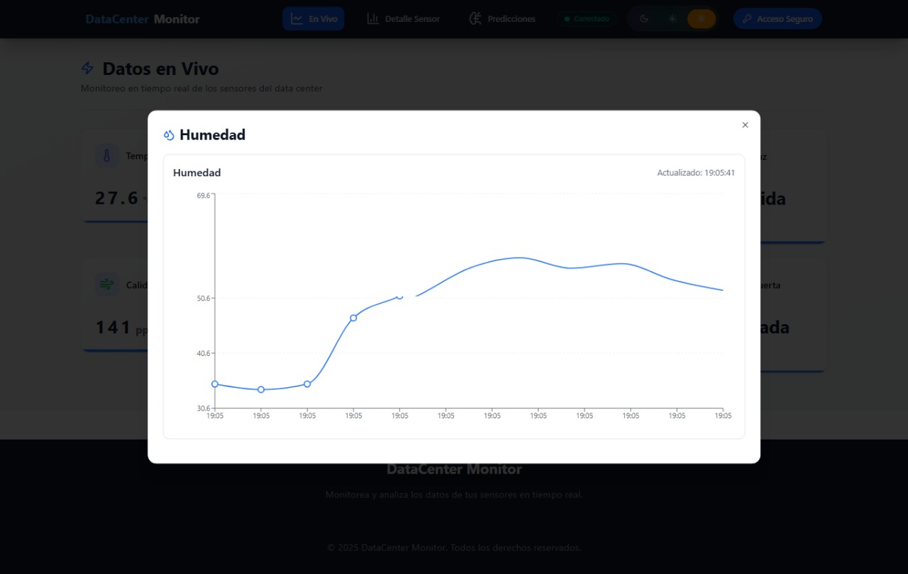
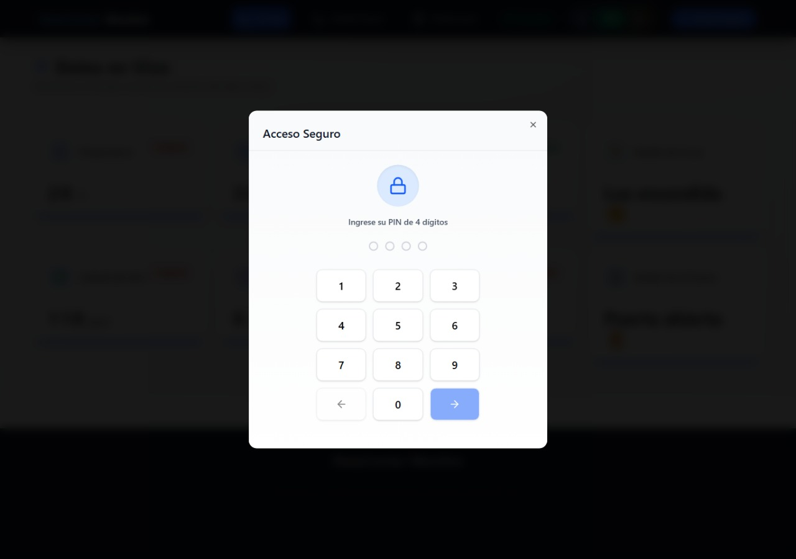
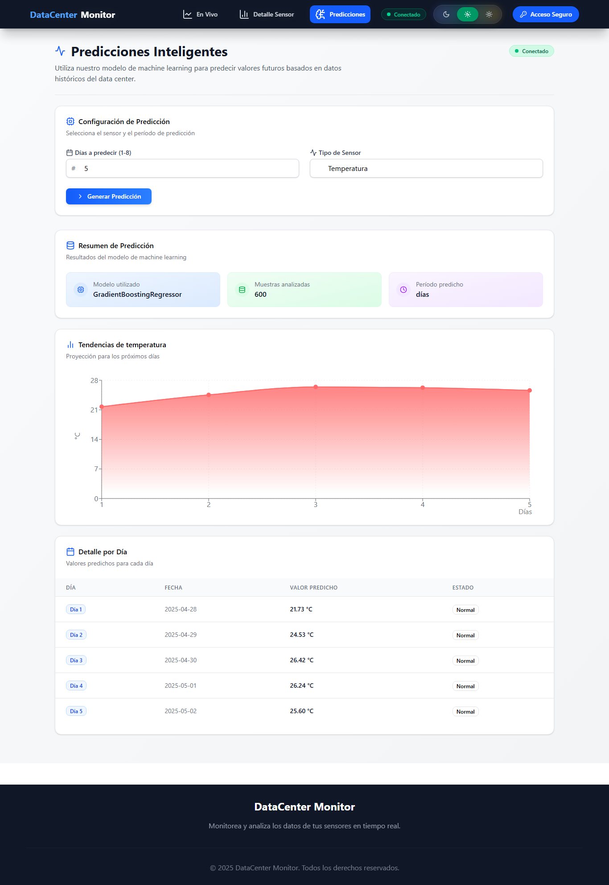
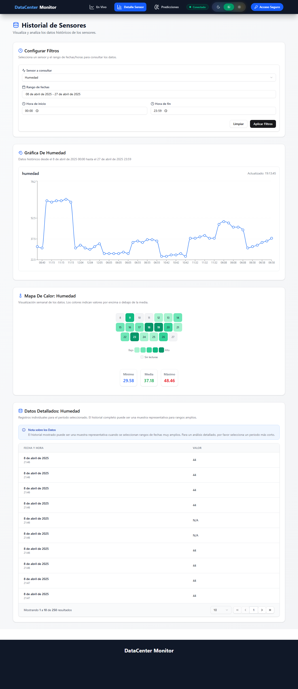

# README: Sistema Inteligente de Monitoreo Ambiental para Centros de Datos

Este repositorio contiene el código fuente del frontend para el Sistema Inteligente de monitoreo ambiental para Centros de Datos mediante IoT.

## ¿Qué es?

Este sistema es una solución integral para la gestión inteligente de cuartos de servidores. Combina sensores IoT, procesamiento de datos en la nube y un dashboard interactivo para visualización y gestión remota. Además, incorpora un sistema de control de acceso con autenticación de doble factor (PIN + reconocimiento facial) para garantizar la seguridad física del entorno.

## ¿Para qué sirve?

El sistema tiene como objetivos principales el monitoreo ambiental en tiempo real de variables como temperatura, humedad, calidad del aire, niveles de luz, corriente eléctrica y presencia de personas. Permite la detección temprana de condiciones críticas, la automatización de respuestas como la activación de ventiladores o luces, un control de acceso seguro, y la visualización y análisis de datos históricos y en tiempo real.

## ¿Cómo se usa?

El frontend proporciona una interfaz web para interactuar con el sistema y visualizar los datos. Permite a los usuarios visualizar en tiempo real los datos de los sensores, como la temperatura, la humedad, la calidad del aire y el consumo de corriente. También ofrece gráficos históricos y alertas visuales cuando los valores superan los límites críticos. Desde el dashboard es posible controlar dispositivos de forma remota, como abrir puertas o apagar dispositivos.

El control de acceso mediante reconocimiento facial requiere un PIN para iniciar el proceso. Para esta funcionalidad el PIN es **4279**.

El sistema desplegado se encuentra disponible en el siguiente enlace: [https://frontend-arqui.vercel.app/](https://frontend-arqui.vercel.app/)

**Nota sobre las funcionalidades:** Actualmente, debido a cuestiones de presupuesto, la API de reconocimiento facial se encuentra en **modo demo** y la API de predicciones está **desactivada**. Por lo tanto, las secciones o pestañas asociadas a estas funcionalidades no mostrarán información relevante o funcional en este momento. La API de datos históricos sí está operativa y la pestaña correspondiente funciona correctamente, conteniendo datos principalmente de abril de 2025.

## ¿Cómo funciona?

El frontend se comunica con los dispositivos IoT a través del protocolo MQTT para mostrar datos en tiempo real. También consume APIs REST para obtener datos históricos y para el (actualmente en modo demo/desactivado) reconocimiento facial y predicciones. La arquitectura del frontend se basa en componentes.

## Pestañas Principales

El frontend cuenta con las siguientes vistas principales:

### LiveDashboard

Muestra datos en tiempo real de los sensores con indicadores visuales y gráficos interactivos. Incluye animaciones y un diseño responsive.

### PredictionsPage

Interfaz para generar y visualizar predicciones. Actualmente deshabilitada, por lo que esta pestaña no mostrará información funcional.

### SensorDetail

Permite visualizar datos históricos con filtros por fecha y sensor, gráficos temporales, mapas de calor y tablas de datos detallados. Esta pestaña funciona correctamente con los datos disponibles.

## Tecnologías Utilizadas

El frontend fue desarrollado utilizando las siguientes tecnologías:

* **React:** Biblioteca principal para la construcción de interfaces de usuario.
* **Vite:** Bundler y herramienta de desarrollo.
* **Tailwind CSS:** Framework CSS para estilizado.
* **MQTT.js:** Cliente MQTT para comunicación en tiempo real.
* **Framer Motion:** Para animaciones y transiciones.
* **date-fns:** Para manejo de fechas.
* **Lucide React:** Para iconos.
* **shadcn:** Para la facilitación en la creación de interfaces.

Para más detalles técnicos, diagramas y explicación de otros componentes del sistema (hardware, backend, APIs), consultar la documentación completa del proyecto.

El repositorio del proyecto se encuentra en: [https://github.com/AngelSGonza2107/ARQUI2B_1S2025_G16.git](https://github.com/AngelSGonza2107/ARQUI2B_1S2025_G16.git)